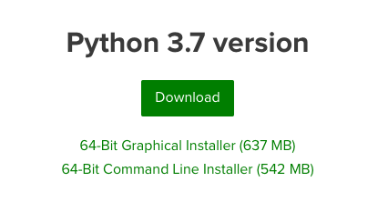
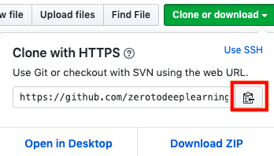
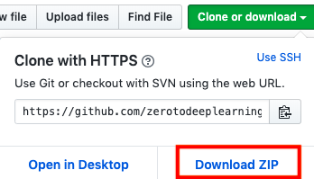
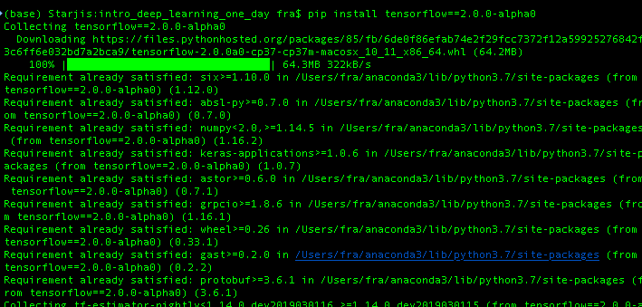

## [Check our Zero To Deep Learning 5 day bootcamp. New dates are out!](https://www.zerotodeeplearning.com/?utm_source=github.com&utm_medium=affiliate&utm_campaign=https%3A%2F%2Fgithub.com%2Fzerotodeeplearning%2Fintro_machine_learning_one_day&utm_content=README.md)
------

[](https://travis-ci.org/zerotodeeplearning/intro_machine_learning_one_day)


# Intro to Machine Learning One Day Workshop

Hands-on Introduction to Machine Learning with Python and Tensorflow


## Quick start guide

### Download and Install Anaconda Python 3.7

The first step is to download and install Python 3 on your system, together with all the necessary libraries. Luckily for us Anaconda provides a convenient way to do so. Download and install it from here:

https://www.anaconda.com/distribution


Make sure to choose the **Python 3.7** version:



> TIP: if you already have Anaconda installed with Python 3.6 instead of 3.7, that is ok too. You will still need to install tensorflow as explained below, and `pip` will install the version for python 3.6. Alternatively, you can create a new environment with Python 3.7 and all the required packages, also explained below.

### Obtain the code for this tutorial
Next we are going to download the code for this tutorial, which is stored on Github. The following commands should be run from a terminal. Open a **Terminal** (Mac/Linux) or an **Anaconda prompt** (Windows). To obtain the code, clone this repository on your local computer. Type:
```
git clone https://github.com/zerotodeeplearning/intro_machine_learning_one_day.git
```
You can copy the full path from Github by clicking on the copy button:



> TIP: If you are not familiar with Git and Github you can just download the zip file of the repository.



#### Change to course folder
Once you have cloned or downloaded the code, make sure to change the current directory to the folder you've just downloaded, by typing:
```
cd intro_machine_learning_one_day
```

> TIP: If you downloaded the zip file and not the repo, you will need to unzip it and then your folder will be named `intro_machine_learning_one_day_master`. Just change directory using that one: `cd intro_machine_learning_one_day_master`


### Install Tensorflow
Anaconda already contains all the packages we need, except for Tensorflow. Which we need to install. We will install the alpha version of Tensorflow 2.1.0 In the terminal type:
```
pip install tensorflow==2.1.0
```
and agree to the package install and updates requests.

> TIP: If you prefer not to install Tensorflow in your base environment see instructions below for how to create a separate environment for this tutorial.



### Launch Jupyter Notebook

From the course folder, in the terminal, type:
```
jupyter notebook
```
If the command is not recognized try to close and open the terminal again, maybe the path needs to be updated after installation.

> TIP: You can also launch Jupyter using the Anaconda Launcher. This will open Jupyter at your default Home location and you will have to manually navigate to the course folder.

#### Open your browser to

If it didn't open automatically, you can find Jupyter at the following url:
```
http://localhost:8888
```

You are good to go! Enjoy!


### Optional: create a dedicated environment or the tutorial
The following is not necessary for the tutorial. If you want to create a virtual environment specifically for this tutorial, we provide an [environment configuration file](environment.yml).
#### Create the course environment
```
conda env create
```
wait for the environment to create, this may take a few minutes

#### Activate the environment (Mac/Linux)
```
conda activate ztdlbootcamp
```

#### Activate the environment (Windows)
```
activate ztdlbootcamp
```

Check that your prompt changed to

```
(ztdlbootcamp) $
```

Now you can run jupyter notebook from within the environment.


### Troubleshooting

#### Updating Conda

If you have installed Anaconda a long time ago, you may want to update it by running

```
conda update conda
```

and then

```
conda update anaconda
```
